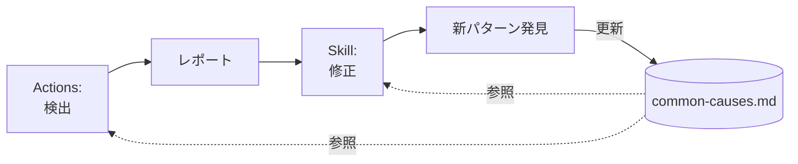

## はじめに

Zennでは、CIテストとして以下の3種類のテストを実行しています。

- フロントエンドのユニットテスト（Vitest）
- バックエンドのユニットテスト（RSpec）
- フロントエンドとバックエンドを統合したE2Eテスト（Playwright）

このうち、RSpecとPlaywrightについては、CIの実行時間を短縮するためテストの並列化を導入しており、ローカル環境では気づきにくいFlakyテストが存在していました。

調べてみると、1/26〜1/30の5日間で、テスト実行100回中11回が失敗していました。これはFlakyテスト以外の失敗も含みますが、体感と大きなずれはありません。リトライは1回あたり4〜8分かかるので、ちょいちょい作業を止める必要がありました。

これを何とかしたいと思い、Flakyテストを自動検出・修正する仕組みをClaude CodeとGitHub Actionsで作成しました。結果として、直近1週間ではFlakyテストによる失敗はほぼ発生しなくなりました。

この記事では、その仕組みの作り方と運用の経験を共有します。

## ステップ1. 手動実行からSkill化

まずはローカル環境で、Claude Codeに **「GitHub Actionsの失敗履歴を見て、Flakyテストを特定して修正して」** と手順を伝えて実行してもらいました。やってみると、適切にghコマンドを使い失敗履歴を収集して、原因を分析して、1つのFlakyテストを修正することができました。

繰り返し実行可能にするために、Claude Codeで実行した内容をそのままSkillにするように指示してSkillを作成しました。2回目は **「Flakyテストを修正して」** と伝えるだけで、Skillを使って実行できるようになりました。

工夫した点として、 **「実行のたびにSkillを改善する」** というステップをSkill自体に組み込みました。Flakyテストには発生パターンが有り、修正にはナレッジが重要なので、新しいパターンを発見したらSkillに反映していく仕組みにしました。

実際に、初期のSkillでは「ページロード完了前の操作」の対策として `waitUntil: 'networkidle'` を推奨していましたが、運用を続けるうちに **networkidle自体がFlakyテストの原因になる** ことがわかりました。`networkidle` は「500ms間ネットワークリクエストがない」という曖昧な条件で判定するため、バックグラウンドリクエストやポーリングがあると不安定になります。この知見を得て、Skillを「networkidle禁止、代わりに具体的なAPI応答待ちを使う」に更新しました。Skillの自己改善サイクルが機能した具体例です。

何度か繰り返し実行した結果、以下のようなSkillが完成しました。

:::details Skillの構成例（簡易化しています）

```
.claude/skills/fix-flaky-tests/
├── SKILL.md              # スキル定義
├── collect-failures.md   # 失敗履歴収集の手順
├── identify-flaky-tests.md # Flakyテスト特定の手順
├── common-causes.md      # よくある原因と対策パターン
├── verify-fix.md         # 修正確認の手順
└── update-knowledge.md   # ナレッジ更新の手順
```

**SKILL.md（スキル定義）**

```markdown
# Flakyテスト修正スキル

GitHub Actionsの失敗履歴を分析し、不安定なテストを特定・修正します。

## 作業フロー

1. 失敗履歴の収集
2. Flakyテストの特定
3. 原因調査
4. 修正の実装
5. 安定性の確認（10回実行で100%成功）
6. 知見の更新（スキル自体に学んだパターンを反映）

## 操作ガイド一覧

- ./collect-failures.md: GitHub Actionsから失敗履歴を収集する方法
- ./identify-flaky-tests.md: Flakyテストを特定する方法
- ./common-causes.md: よくある原因と対策パターン
- ./verify-fix.md: 修正後の安定性確認方法
- ./update-knowledge.md: 得られた知見をスキルに反映する方法
```

**collect-failures.md（失敗履歴収集の手順）**

```markdown
# 失敗履歴の収集

GitHub CLIを使用して、各テストワークフローの失敗履歴を収集します。

## 手順

### 1. 失敗した実行一覧を取得
gh run list --workflow="ワークフロー名" --status=failure --limit=25

### 2. 各実行の失敗ログを取得
gh run view {runId} --log-failed

### 3. 失敗テストを集計
抽出したテストケースを集計し、失敗回数をカウントします。
```

**identify-flaky-tests.md（Flakyテスト特定の手順）**

```markdown
# Flakyテストの特定

## 分析観点

### 1. 失敗頻度
失敗回数が多いテストを優先的に修正します。

### 2. 失敗パターンの分類
失敗原因を分類して、同じ根本原因を持つテストをまとめて修正できるか検討します。

| パターン | 原因 |
|---------|------|
| タイムアウト | ページロード/API応答待ち不足 |
| 要素が見つからない | 非同期レンダリング |
| UniqueViolation | テストデータ競合 |
| 順序依存 | DBクエリ結果の順序が不定 |

### 3. 影響範囲
同じコンポーネントやAPIを使用するテストは、1つの修正で複数が安定する可能性があります。
```

**common-causes.md（よくある原因と対策パターン）の抜粋**

```markdown
## 重要な原則

1. **いたずらにタイムアウトを追加しない。** 適切な状態変化を待つことで解決する。
2. **`networkidle` を使用しない。** 「500ms間ネットワークリクエストがない」という曖昧な条件であり、不安定の原因になる。代わりに、特定のAPIレスポンス・要素の表示など、具体的な条件を待つ。

## 原因と対策一覧

### 1. ページロード完了前の操作
**症状:** ページ遷移直後の操作がタイムアウト
**対策:** 特定のAPIレスポンス（例: `/me`）の完了を待ってからUI操作する

### 2. 要素が表示される前のクリック
**症状:** element not visible
**対策:** waitFor({ state: 'visible' }) で表示を待つ

### 3. API応答を待たないクリック
**症状:** 後続の操作が失敗
**対策:** Promise.all で waitForResponse とクリックを同時実行

### 4. テストデータの競合
**症状:** PG::UniqueViolation
**対策:** ランダム値を使用してユニーク制約を回避

### 5. データベースクエリ結果の順序依存
**症状:** 配列インデックスアクセスで期待と異なる要素
**対策:** find で条件に合う要素を探す順序非依存の検証に変更
```

**verify-fix.md（修正確認の手順）**

```markdown
# 修正後の安定性確認

## 確認方法

### Playwright E2Eテストの場合
pnpm exec playwright test {テストファイル} --repeat-each=10 --workers=2

### RSpec（バックエンド）の場合
10回繰り返し実行し、すべて成功することを確認

## 成功基準

- **必須:** 10回中10回パス（100%成功率）
- 並列実行での安定性を確認すること
```

**update-knowledge.md（ナレッジ更新の手順）**

```markdown
# 知見の更新

修正作業を通じて得られた新しい知見をスキル自体に反映し、将来の修正作業に活かします。

## 更新対象

1. **common-causes.md** - 新しい原因パターンと対策を発見した場合
2. **identify-flaky-tests.md** - 新しい分析観点や失敗パターンの分類を発見した場合
3. **verify-fix.md** - 確認方法や成功基準に改善点があれば

## 更新のタイミング

- 新しい原因パターンを発見した時
- 既存パターンの改善策を発見した時
- プロジェクト固有の知見を得た時

## チェックリスト

- [ ] 新しい原因パターンはあったか？
- [ ] 既存パターンで改善できる点はあったか？
- [ ] 上記がある場合、該当ファイルを更新したか？
```

:::

## ステップ2. GitHub Actionsで定期実行化

ローカルでSkillを使ってFlakyテストの検出・修正ができることが確認できたので、これをGitHub Actionsで定期実行する仕組みを作りました。

Actionsで修正PRの自動生成まで行うことも考えましたが、検出と修正は別々のActionsに分離した方がシンプルにできそうだったので、まずはActionsでは検出とレポート作成にとどめ、人間がローカルでSkillを使って修正作業を行うフローにしました。

レポートの出力形式はいくつか選択肢がありましたが、issueにコメントを追加する形式が容易だったのでこれにしました。週に1回、Flakyテストを検出してissueにレポートを作成します。

Skillで蓄積したナレッジはActionsでも活用したいので、Actionsのプロンプトから `common-causes.md` を参照するようにしました。これにより、修正のたびにナレッジが成長していくサイクルができました。



### つまずいたポイント

最初に動かしたときは、Claude Codeが何も分析できずに終わりました。出力されたレポートがこちらです。

```
本分析ではghコマンドへのアクセス権限がなかったため、GitHub Actions履歴から
実際の失敗データを取得できませんでした。
完全な分析を行うには、gh run listやgh apiコマンドの実行を許可するか、
ワークフローの前段階で収集された/tmp/ディレクトリ内のファイルへの
アクセスを許可する必要があります。
```

原因は `--allowedTools` の未指定でした。GitHub Actionsの非対話モード（`claude -p`）では、Claude Codeがユーザー確認を必要とするツールを使用するために `--allowedTools` で明示的に許可する必要があります。そこで、ghコマンドや `/tmp/` のファイル読み取りを許可しました。

```yaml
--allowedTools "Read(//tmp/**)" "Bash(gh *)"
```

これで失敗データを読めるようになりましたが、今度は別の問題が発生しました。修正済みのFlakyテストが「未対応」と報告されました。調べてみると、`--allowedTools` は**ホワイトリスト方式**で動作していました。指定したツールだけが許可されるため、デフォルトで使えていたカレントディレクトリのソースコード読み取り（`Read`）が無効になっていました。

最終的には、調査に必要なツールを一通り許可する形に落ち着きました。

```yaml
--allowedTools "Read" "Bash(gh run view *)" "Bash(gh run list *)" "Bash(git log *)" "Bash(git show *)" "Grep" "Glob"
```

なお、Claude CodeはVertex AI経由で利用しています。詳しくは「[Claude CodeをVertex AI経由で使う](https://zenn.dev/team_zenn/articles/claude-code-vertex-ai)」を参照してください。

:::details ワークフローの例（簡易化しています）

```yaml
name: Detect Flaky Tests

on:
  schedule:
    - cron: '0 0 * * 0'  # 毎週日曜
  workflow_dispatch:
    inputs:
      days:
        description: '分析対象の日数'
        default: '14'

permissions:
  contents: read
  issues: write
  actions: read
  id-token: write

jobs:
  detect-flaky:
    runs-on: ubuntu-latest
    timeout-minutes: 30

    steps:
      - uses: actions/checkout@v6
        with:
          fetch-depth: 0

      - uses: actions/setup-node@v6
        with:
          node-version: 22.x

      - name: Authenticate to Google Cloud
        id: auth
        uses: google-github-actions/auth@v3
        with:
          workload_identity_provider: ${{ secrets.GCP_WORKLOAD_IDENTITY_PROVIDER }}
          service_account: ${{ secrets.GCP_SERVICE_ACCOUNT }}

      - name: Install Claude Code
        run: npm install -g @anthropic-ai/claude-code

      - name: Collect failure history
        env:
          GH_TOKEN: ${{ secrets.GITHUB_TOKEN }}
          DAYS: ${{ github.event.inputs.days || '14' }}
        run: |
          SINCE=$(date -u -d "${DAYS} days ago" +%Y-%m-%d)

          # 各ワークフローの失敗履歴を収集
          gh run list --workflow="テストワークフロー名" --status=failure \
            --limit=100 --created ">=${SINCE}" \
            --json databaseId,conclusion,createdAt,headBranch \
            > /tmp/failures.json

      - name: Collect failure logs
        env:
          GH_TOKEN: ${{ secrets.GITHUB_TOKEN }}
        run: |
          mkdir -p /tmp/failure-logs
          jq -r '.[].databaseId' /tmp/failures.json | while read run_id; do
            gh run view "$run_id" --log-failed > "/tmp/failure-logs/${run_id}.log" 2>/dev/null || true
          done

      - name: Analyze with Claude Code
        env:
          ANTHROPIC_VERTEX_PROJECT_ID: ${{ steps.auth.outputs.project_id }}
          CLOUD_ML_REGION: us-east5
          CLAUDE_CODE_USE_VERTEX: "1"
          GH_TOKEN: ${{ secrets.GITHUB_TOKEN }}
        run: |
          claude -p "失敗履歴とログを分析してFlakyテストを特定してください。
          .claude/skills/fix-flaky-tests/common-causes.md を参照して修正案を提示してください。" \
            --print --output-format text \
            --allowedTools "Read" "Bash(gh run view *)" "Bash(gh run list *)" "Grep" "Glob" \
            > /tmp/flaky-report.md

      - name: Create or update issue
        env:
          GH_TOKEN: ${{ secrets.GITHUB_TOKEN }}
        run: |
          REPORT=$(cat /tmp/flaky-report.md)

          # Flakyテストが検出されなかった場合はスキップ
          if echo "$REPORT" | grep -q "Flakyテストは検出されませんでした"; then
            exit 0
          fi

          # 既存のIssueにコメント追加、または新規作成
          EXISTING_ISSUE=$(gh issue list --label "flaky-test" --state open --json number --jq '.[0].number')
          if [ -n "$EXISTING_ISSUE" ]; then
            gh issue comment "$EXISTING_ISSUE" --body "$REPORT"
          else
            gh issue create --title "Flakyテスト検出レポート" --body "$REPORT" --label "flaky-test"
          fi
```

:::

## まとめ

本記事では、特定のタスクを「手動指示」→「Skill化」→「自動化（Actions化）」というステップで進めることで、手作業だった作業を半自動化した事例を紹介しました。

最初から完璧な仕組みを作ろうとせず、手動で試してみて、うまくいくことを確認してから自動化する。このアプローチは、他のタスクにも応用できると思います。
