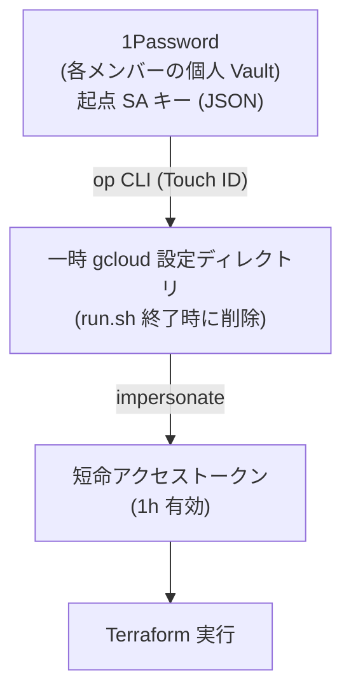

# ローカル Terraform の GCP 認証を ADC から 1Password + Service Account Impersonation に置き換えた

## はじめに

ローカル PC から Terraform で GCP リソースを管理するとき、これまで認証は `gcloud auth application-default login` (ADC) を使っていました。便利なのですが、ADC は事実上無期限のリフレッシュトークンをディスク上に残します。

近年は npm / pip / brew パッケージなどに悪意あるコードを紛れ込ませてローカルの認証情報を盗み出すサプライチェーン攻撃が頻発しており、もし `~/.config/gcloud/` を読み取るマルウェアを踏んでしまうと、本番を含む全プロジェクトを長期間にわたって操作される可能性があります。このリスクへの対策として、認証方式を見直してみました。

理想形としては Terraform 実行を CI/CD に集約して Workload Identity Federation で keyless 化する形だと思います。ですが我々のプロジェクトでは、ローカルから直接反映できる運用のほうが日々の小回りが利いて望ましいという判断があります。そのため、ローカル運用を維持する前提で認証だけセキュアにする方針として、**1Password + Service Account Impersonation** の構成にしてみました。

## 前提

我々のプロジェクトでは、terraform CLI をローカルに直接インストールせず、`hashicorp/terraform` の Docker イメージを `run.sh` というラッパースクリプト経由で呼び出しています。

```bash
./run.sh {環境名} {コマンド}
./run.sh dev plan
./run.sh prd apply
```

こうしている理由は以下です。

- terraform のバージョンを `run.sh` 内で固定でき、環境差を生まない
- 環境変数や認証情報の渡し方を一箇所に集約できる

## これまでの認証方法

これまでの認証フローは以下の通りでした。

1. 開発者が `gcloud auth application-default login` を実行します
2. ブラウザで Google アカウントにログインします
3. 認証情報が `~/.config/gcloud/application_default_credentials.json` に保存されます
4. `run.sh` がこのファイルを Docker コンテナにマウントし、Terraform が利用します

```bash:terraform/run.sh (旧)
docker run -it --rm \
  -v $PWD:/work \
  -v $HOME/.config/gcloud:/.config/gcloud \
  -w /work \
  -e GOOGLE_APPLICATION_CREDENTIALS=/.config/gcloud/application_default_credentials.json \
  --entrypoint "/bin/sh" \
  hashicorp/terraform:$version \
  -c "cd environments/$environment && terraform $command"
```

## ADC の問題点

`application_default_credentials.json` の中身は OAuth **リフレッシュトークン**です。これは寿命がほぼ無期限で、奪取されると以下が成立してしまいます。

- 攻撃者がいつでも新しいアクセストークンを発行できます
- ユーザー本人と同等の権限で GCP を操作できます (本番含む全プロジェクト)
- 強制的な失効に手間がかかります (再ログインや revoke を本人がしない限り有効)

ローカルマルウェアや誤ったファイル共有で `~/.config/gcloud/` が漏れたら、本人が気づかないうちに長期間悪用される可能性があります。

## 新しい認証方法

### 全体像


### 2 段構成の Service Account

各環境 (dev / itg / prd) に 2 つの SA を用意します。

| SA | 役割 | 権限 |
|---|---|---|
| `terraform-runner` | Terraform の実操作 | プロジェクト owner |
| `terraform-bootstrap` | impersonate の起点 (1Password 保管) | runner SA への TokenCreator のみ |

起点 SA (bootstrap) は **権限を一切持たない**のがポイントです。runner SA を impersonate する権限だけを持っています。これにより以下のメリットがあります。

- 万一 bootstrap キーが漏れても、それ単独では何もできません
- 実操作は impersonate 経由なので、監査ログに「誰が誰になりすましたか」が残ります

### キーは個人ごとに発行 (共有しない)

bootstrap SA キーは **チームで共有しません**。各メンバーが自分用のキーを発行し、自分の 1Password に保管します。

これにより以下が実現できます。

- 退職や端末紛失時は **そのユーザーのキーを 1 つ無効化**するだけで済みます
- 監査ログの key ID から誰の操作かを追跡できます

### `run.sh` の動き

```bash:terraform/run.sh (新・抜粋)
# 1. 隔離した gcloud 設定ディレクトリを作成し、終了時の自動削除を仕込む
gcloud_tmp=$(mktemp -d -t terraform-gcloud-XXXXXX)
chmod 700 "$gcloud_tmp"
trap 'rm -rf "$gcloud_tmp"' EXIT
export CLOUDSDK_CONFIG="$gcloud_tmp"

# 2. 1Password から起点 SA キーを取得 (Touch ID で本人確認)
op_vault=$(op item get "$op_item" --format json | jq -er '.vault.name')
op read "op://${op_vault}/${op_item}/credential" > "$gcloud_tmp/bootstrap-key.json"

# 3. gcloud にアクティベート
gcloud auth activate-service-account --key-file="$gcloud_tmp/bootstrap-key.json"

# 4. Runner SA を impersonate して 1h 有効トークン取得
ACCESS_TOKEN=$(gcloud auth print-access-token \
  --impersonate-service-account="$runner_sa")

# 5. Terraform に環境変数で渡す (ファイルマウントなし)
docker run -e GOOGLE_OAUTH_ACCESS_TOKEN="$ACCESS_TOKEN" ...
# スクリプト終了時、step 1 で仕込んだ trap が gcloud_tmp を削除する
```

### セキュリティ的な改善ポイント

- ディスクに **長命な認証情報を置きません**
- アクセストークンは **1 時間で自動失効**するため、漏洩しても影響を限定できます
- 1Password の Touch ID により **物理的な端末がないと取得できません**
- 1Password と GCP の双方に **監査ログ**が残ります
- ユーザー単位で **即時無効化**できます

## セットアップ手順

### 1. チーム管理者の作業 (環境ごとに 1 回のみ)

各環境 (dev / itg / prd) で、Runner SA と Bootstrap SA を用意します。

```bash
# === 環境ごとに変更 ===
PROJECT_ID="my-project-dev"          # 環境ごとの GCP プロジェクト ID に置き換える
ENV_LABEL="dev"                       # dev / stg / prd など、環境を識別するラベル

# === 以下は固定 ===
TFSTATE_BUCKET="${PROJECT_ID}-tfstate"
RUNNER_EMAIL="terraform-runner@${PROJECT_ID}.iam.gserviceaccount.com"
BOOTSTRAP_EMAIL="terraform-bootstrap@${PROJECT_ID}.iam.gserviceaccount.com"

gcloud config set project "$PROJECT_ID"

# Runner SA を作成
gcloud iam service-accounts create terraform-runner \
  --display-name="Terraform Runner ($ENV_LABEL)" \
  --description="Terraform 実行用 SA。bootstrap SA から impersonate される"

# Bootstrap SA を作成
gcloud iam service-accounts create terraform-bootstrap \
  --display-name="Terraform Bootstrap ($ENV_LABEL)" \
  --description="1Password に鍵を保管する起点 SA"

# Runner SA にプロジェクト管理権限を付与
# プロジェクトに既存の条件付きバインディングがあると対話プロンプトが出るため、
# --condition=None を明示しておくと非対話で進む
gcloud projects add-iam-policy-binding "$PROJECT_ID" \
  --member="serviceAccount:${RUNNER_EMAIL}" \
  --role="roles/owner" \
  --condition=None

# Runner SA に state バケットの権限を付与
gcloud storage buckets add-iam-policy-binding "gs://${TFSTATE_BUCKET}" \
  --member="serviceAccount:${RUNNER_EMAIL}" \
  --role="roles/storage.objectAdmin"

# Bootstrap SA に「Runner SA を impersonate する」権限のみ付与
gcloud iam service-accounts add-iam-policy-binding "$RUNNER_EMAIL" \
  --member="serviceAccount:${BOOTSTRAP_EMAIL}" \
  --role="roles/iam.serviceAccountTokenCreator"
```

ポイントは、**Bootstrap SA には Runner SA への impersonate 権限以外を一切持たせない**ことです。万一キーが漏れても、Runner SA を介さないと何もできない状態にしておきます。

### 2. 各メンバーの作業 (環境ごとに自分用のキーを発行)

各メンバーは、自分用の起点 SA キーを発行し、自分の 1Password に保管します。

#### 2-1. 1Password CLI のセットアップ

```bash
# macOS の場合
brew install --cask 1password-cli
```

1Password アプリの **Settings → Developer → Integrate with 1Password CLI** を有効にすると、`op` コマンドが Touch ID で解錠できるようになります。

#### 2-2. 起点 SA キーの発行と 1Password への保管

dev / itg / prd の 3 環境それぞれで以下を実行します。

```bash
# === 環境ごとに変更 ===
PROJECT_ID="my-project-dev"
ENV_LABEL="dev"

# === 共通 ===
BOOTSTRAP_EMAIL="terraform-bootstrap@${PROJECT_ID}.iam.gserviceaccount.com"
KEY_FILE=$(mktemp -t bootstrap-${ENV_LABEL})

# 自分用のキーを発行
gcloud iam service-accounts keys create "$KEY_FILE" \
  --iam-account="$BOOTSTRAP_EMAIL"

# 1Password に保管 (JSON テンプレート + stdin で渡す)
jq -n \
  --arg title "tf-bootstrap-${ENV_LABEL}" \
  --rawfile cred "$KEY_FILE" \
  '{
    title: $title,
    category: "API_CREDENTIAL",
    fields: [
      {id: "credential", type: "CONCEALED", label: "credential", value: $cred}
    ]
  }' \
  | op item create -

# ローカルの一時ファイルは安全に削除
rm -P "$KEY_FILE"
```

ここで `op item create "credential[password]=$(cat $KEY_FILE)"` のように **assignment statement で機密値を渡すのは避けています**。1Passwordの[公式ドキュメント](https://developer.1password.com/docs/cli/item-create/#with-assignment-statements)は以下のように説明しており、コマンド引数だと他プロセスから値が見える可能性があるためです。

> Command arguments can be visible to other processes on your machine. If you're assigning sensitive values, use **an item JSON template** instead.

`jq --rawfile` で SA キー JSON を JSON 文字列として正しくエスケープし、stdin から `op item create -` に流し込むことで、コマンドラインに値が出ないように扱っています。

> 1Password の Item 名は `tf-bootstrap-{env}` 形式に揃えます。`run.sh` がこの名前で検索するので、変えると動かなくなります。Vault は個人の好きな場所 (Private 等) で構いません。

### 3. 古い ADC ファイルの削除

新方式に切り替えたら、もう不要なので削除しておきます。

```bash
gcloud auth application-default revoke
rm -f $HOME/.config/gcloud/application_default_credentials.json
```

## おわりに

ADC ファイルは「便利だが危険」だった一方、SA キーをそのまま配るのも別の意味でリスクがあります。1Password + impersonation の組み合わせは、

- 長命な秘密はディスクに置かない
- 実操作は短命トークンで行う
- ユーザー単位で発行・失効できる
- 監査ログで追跡できる

というバランスを取れる現実解だと感じました。認証の理想形は CI/CD + WIF だと思いますが、ローカルから直接反映できる運用のほうが我々のプロジェクトには望ましいので、ローカル運用を維持しつつ認証をセキュアにする方向として 1Password + impersonate を選びました。

参考になりましたら幸いです。
