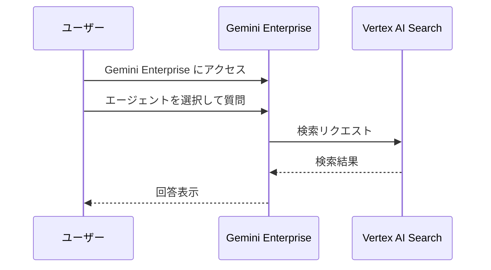
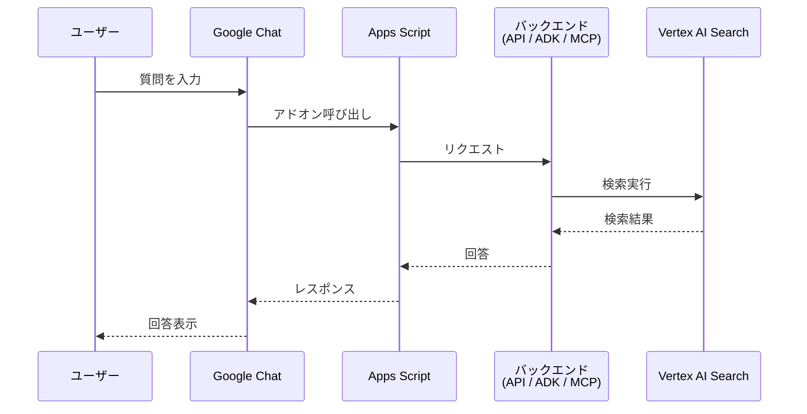
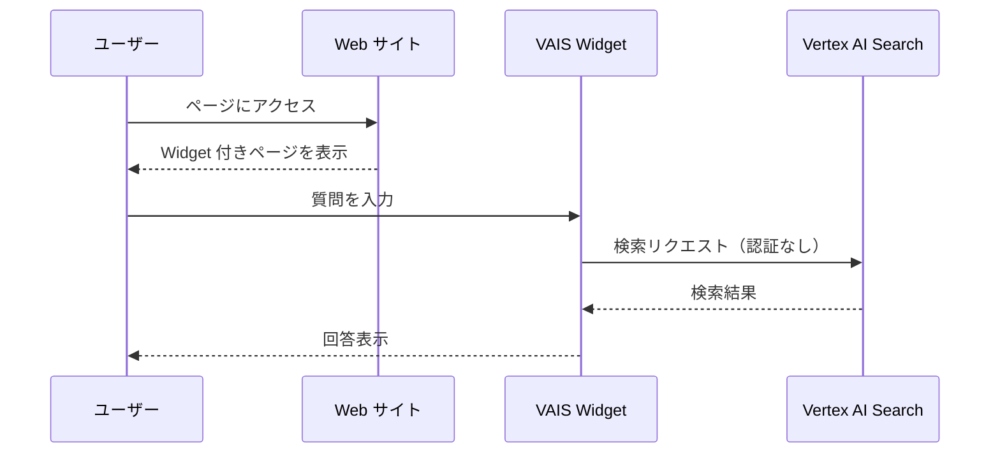
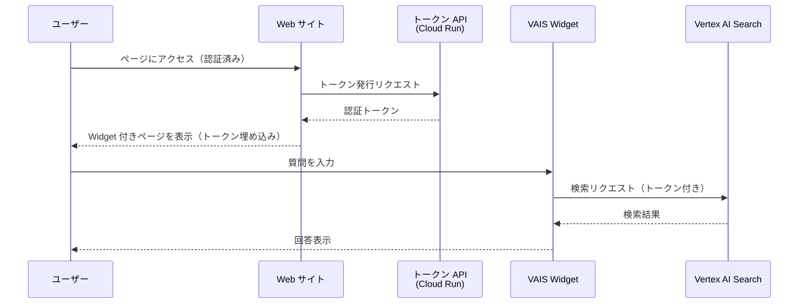
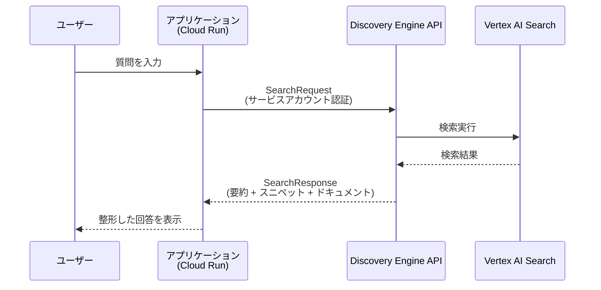
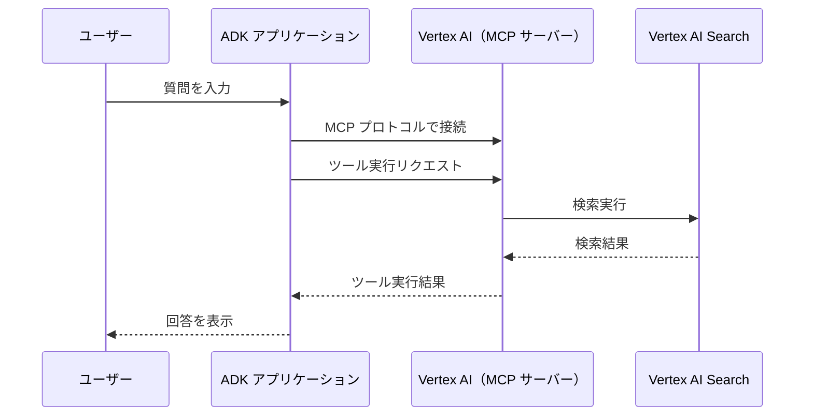

## はじめに

Vertex AI Search でデータストアとエンジン（アプリ）を作成したあと、「これをエンドユーザーにどう届けるか」で意外と悩みました。公式ドキュメントを読んでいくと提供方法がいくつかあるのですが、それぞれの違いや認証の流れがぱっと掴みづらかったので、自分なりに整理してみます。

## 提供方法

Vertex AI Search エンジンの提供方法は、大きく以下の3カテゴリに分かれます。

**Google サービス連携**

Gemini Enterprise や Google Chat など、Google のサービス上でエンジンを利用する。

| 提供方法 | 認証 | 開発規模 |
|---|---|---|
| Gemini Enterprise への共有 | Google アカウント認証 | なし |
| Google Chat（Workspace アドオン） | Google アカウント認証 | 小 |

**Widget**

Web サイトに検索 UI を埋め込む。

| 提供方法 | 認証 | 開発規模 |
|---|---|---|
| Widget（公開） | なし | 小 |
| Widget（認証） | OAuth or JWT | 中 |

**組み込み**

API や MCP を使って自前のアプリケーションに検索機能を組み込む。

| 提供方法 | 認証 | 開発規模 |
|---|---|---|
| API（Discovery Engine） | サービスアカウント | 中〜大 |
| MCP（Model Context Protocol） | サービスアカウント | 中〜大 |

それぞれの流れを見ていきます。

## Gemini Enterprise への共有

Vertex AI Search エンジンを Gemini Enterprise に共有する方法です。共有されたユーザーは、Gemini Enterprise の Web アプリ上でエージェントを直接利用できます。開発作業は不要で、もっともシンプルな提供方法です。

https://docs.cloud.google.com/architecture/rag-genai-gemini-enterprise-vertexai?hl=ja

Gemini Enterprise は Google Workspace とは独立した Google Cloud のプラットフォームで、エージェントの公開・ガバナンスを一元管理できます。

### 特徴

- 追加のインフラ構築・開発が不要
- Gemini Enterprise の Business / Standard / Plus エディションで利用可能
- エージェントへのアクセス権限を管理者が制御できる
- UI のカスタマイズは限定的

## Google Chat（Workspace アドオン）

Google Chat のアドオンとして Vertex AI Search の検索機能を提供する方法です。Apps Script を中継役として、バックエンドの Vertex AI Search を呼び出します。

https://codelabs.developers.google.com/vertexai-gws-agents?hl=ja

バックエンドの呼び出し方法は実装次第で、Discovery Engine API を直接呼び出す方法、ADK エージェント経由、MCP 経由など、要件に応じて選択できます。

### 特徴

- Google Workspace アドオンがサポートされるプランで利用可能
- Apps Script でアドオンを構築する必要があるため、多少の開発作業が発生する
- Google Workspace の認証に依存するため、社内アカウントでのアクセス制限が自動的に適用される
- Gmail のサイドバーなど、他の Workspace サービスへのアドオン拡張も可能

## Widget の提供

Vertex AI Search には、検索 UI を Web コンポーネントとして Web サイトに埋め込める Widget 機能が用意されています。認証方式によって、公開（認証なし）と OAuth / JWT 認証の2パターンがあります。

https://cloud.google.com/generative-ai-app-builder/docs/add-widget?hl=ja

### 公開（認証なし）

もっとも手軽な方法です。生成されたコードスニペットを HTML に貼り付けるだけで動きます。

手軽な反面、いくつか注意点があります。

- Widget の JavaScript コードはブラウザに公開されるため、知識があれば外部からもアクセス可能
- VAIS 側の設定で Widget の利用を許可するドメインを制限できるが、完全な防御にはならない
- 機密情報を含むデータストアには不向き

公開 FAQ やデモ用途であれば問題ないと思いますが、機密性の高いデータを扱う場合は認証付きの方式を検討しましょう。

### OAuth / JWT 認証

Widget を認証付きで利用するには、トークンを発行するサーバーが必要になります。OAuth と JWT の使い分けは、サービスアカウントが使える環境かどうかで決まります。

- **OAuth** : Cloud Run などサービスアカウントが利用できる環境向け。サービスアカウントの権限でトークンを発行する
- **JWT** : サービスアカウントが直接使えない環境向け。サービスアカウントのクレデンシャル（秘密鍵）を用いて JWT を署名・発行する

Widget への受け渡しの流れ自体は共通しています。

#### 構成のポイント

- トークン API を Cloud Run 等にデプロイし、認証済みユーザーにのみトークンを発行する
- Cloud Run に IAP（Identity-Aware Proxy）を適用することで、Google Workspace アカウントによるアクセス制限が可能
- JWT 方式ではサービスアカウントのクレデンシャルを安全に管理する必要がある

ちなみに、Google Sites のような静的サイトからはトークンAPIに対する認証付きアクセスができないため、認証付き Widget を使うには動的なサーバーサイド処理が可能なサイトが必要です。

## 組み込み

Widget ではなく、自前のアプリケーションにエンジンの機能を組み込む方法です。

### API（Discovery Engine）

https://docs.cloud.google.com/generative-ai-app-builder/docs/libraries?hl=ja

Discovery Engine API を直接呼び出す方法です。検索パラメータの細かい制御や、検索結果の独自フォーマットが可能で、もっとも自由度が高いです。ADK（Agent Development Kit）からもツールとして Vertex AI Search を呼び出せますが、ADK はエージェント構築の汎用フレームワークなので、ここでは API 直接呼び出しに絞って紹介します。

#### 特徴

- 検索パラメータ（件数、抽出型回答数、要約の言語等）を細かく制御できる
- チャットのUIや検索結果のフォーマットを自由にカスタマイズできる

### MCP（Model Context Protocol）

Vertex AI Search の検索機能を MCP サーバー（`discoveryengine.googleapis.com/mcp`）経由で利用する方法です。ADK の `McpToolset` を使うことで、エージェントのツールとして MCP 経由の検索を組み込めます。（※記事執筆時点でプレビュー機能です。）

https://docs.cloud.google.com/generative-ai-app-builder/docs/reference/mcp

MCP のツールとして `search` / `conversational_search` が提供されており、Discovery Engine API を直接扱わなくても検索機能を利用できます。

#### 特徴

- ADK の `McpToolset` でエージェントのツールとして簡単に統合できる
- Gemini CLI や Claude Code など、MCP 対応クライアントから直接検索する使い方も可能

## まとめ

Vertex AI Search エンジンの提供方法を整理してみました。まとめてしまえば単純なのですが、Widgetの認証方法やアプリをセキュアに提供する方法などを調査するために、だいぶドキュメントとにらめっこしました。

ちなみに、他にも Vertex AI の Agent Builder からデータストアを参照する方法もありますが、現時点ではエンジン（アプリ）には非対応でデータストア単位の参照に限られるため、本記事では割愛しています。

この記事が参考になれば幸いです。
