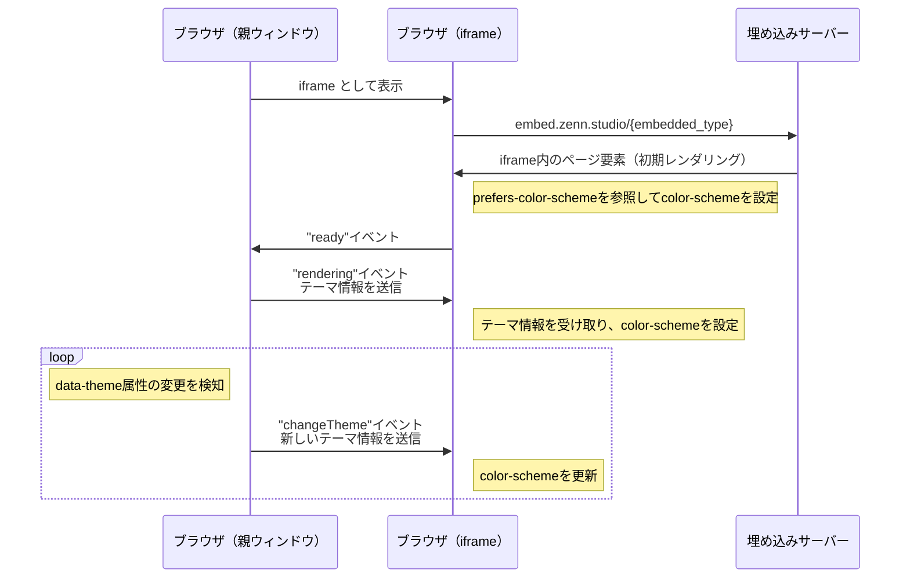

## 背景

Zennのダークモード対応については、リリース当初より望まれていた機能でした。

https://github.com/zenn-dev/zenn-community/issues/267

このissueは2023年に一度クローズしました。当時はZennチームにデザイナーが不在だったこともありデザインシステムやガイドラインのようなものは整備されておらず、数十のページ・数百のコンポーネントにダークテーマを適用していくことは、工数の見積もりすら不可能な状態でした。

しかし、その後も多くの要望が寄せられていたことと、その後にZennチームに加わったデザイナーの[fujisawaさん](https://zenn.dev/fujisawa9000)の貢献により、徐々にデザインのガイドラインなどが整備され、ようやくダークテーマの対応に取り組むこととなりました。

本記事では、Zennのダークモード対応の技術的な要素についてお伝えします。デザイン的な要素については、いつかfujisawaさんから語られることを期待しています。

## 実装

fujisawaさんにデザインのプロトタイプを作成してもらい、そこから実装を進めました。

### テーマの切り替え

はじめに、サイト全体のテーマの状態管理・切り替えの機構を実装しました。

Zennでは、ライトテーマ・ダークテーマ・システムテーマの3つのテーマを選択できるようにしました。システムテーマは、OSの設定に応じてライト・ダークが決定するものです。

実装にあたっては、以下のサイトの情報を参考にさせていただきました。

https://blog.stin.ink/articles/how-to-implement-a-perfect-dark-mode

ポイントとしては以下が挙げられます。

- **初期レンダリングのちらつきをどのように抑えるか:** Reactのレンダリングを待つとちらつくので、JavaScriptで初期状態を決定する
- **OSテーマに連動するかどうか:** 連動する場合は `prefers-color-scheme` を利用する

これらは上記サイトで詳しく解説されているので、改めて説明する必要もないのですが、Zennの実装を載せておきます。

#### ①初期状態の決定とOSテーマの監視

初期状態の決定とOSテーマの監視は、`_document.page.tsx` 内のScriptで行います。初期状態として、ローカルストレージを参照して設定があればそれを、なければライトモードを初期状態とします。さらに、OSテーマの変更を監視し、テーマ設定を更新します。（※OSテーマの監視は、後述のカスタムフックでも行いますが、カスタムフックを読み込まないページでも動作するように、ここでも行っています。）

```javascript:_document.page.tsx（内のScript）
// システムテーマの参照
function getSystemTheme() {
    if (window.matchMedia && window.matchMedia('(prefers-color-scheme: dark)').matches) {
        return 'dark-blue';
    }
    return 'light';
}

// テーマの適用
function applyTheme(theme) {
    let actualTheme;
    if (theme === 'system') {
        actualTheme = getSystemTheme();
    } else {
        actualTheme = theme;
    }
    // HTMLのdata属性にテーマを設定
    window.document.documentElement.dataset.theme = actualTheme;
}

// 初期状態の決定
const storedTheme = localStorage.getItem('theme');
const theme = storedTheme || 'light'; // デフォルトはライトテーマ
applyTheme(theme);

// システムテーマの変更を監視
if (window.matchMedia) {
    window.matchMedia('(prefers-color-scheme: dark)').addEventListener('change', function() {
        const currentTheme = localStorage.getItem('theme') || 'light';
        if (currentTheme === 'system') {
            applyTheme('system');
        }
    });
}
```

#### ②テーマの状態管理

こちらはテーマを管理するカスタムフックです。テーマの状態を管理し、テーマの取得や更新を行う機能を提供します。`codemirror`や`react-diff-viewer`など、独自にテーマを持つコンポーネントに対しても、このカスタムフックからテーマの状態を取得して反映させます。

```typescript:useTheme.tsx
import { useState, useEffect, useCallback, useMemo } from 'react';

type ThemeType = 'light' | 'dark-blue' | 'system';

export const useTheme = () => {
  const [theme, setTheme] = useState<ThemeType>('light');
  const [actualTheme, setActualTheme] = useState<'light' | 'dark-blue'>(
    'light'
  );

  const isDarkMode = useMemo(() => actualTheme !== 'light', [actualTheme]);

  const getSystemTheme = useCallback((): 'light' | 'dark-blue' => {
    if (
      typeof window !== 'undefined' &&
      window.matchMedia &&
      window.matchMedia('(prefers-color-scheme: dark)').matches
    ) {
      return 'dark-blue';
    }
    return 'light';
  }, []);

  const applyTheme = useCallback(
    (themeToApply: ThemeType) => {
      const htmlElement = document.documentElement;
      let resolvedTheme: 'light' | 'dark-blue';

      if (themeToApply === 'system') {
        resolvedTheme = getSystemTheme();
      } else {
        resolvedTheme = themeToApply;
      }

      htmlElement.setAttribute('data-theme', resolvedTheme);
      setActualTheme(resolvedTheme);
    },
    [getSystemTheme]
  );

  const updateTheme = useCallback(
    (newTheme: ThemeType) => {
      localStorage.setItem('theme', newTheme);
      setTheme(newTheme);
      applyTheme(newTheme);
    },
    [applyTheme]
  );

  useEffect(() => {
    const storedTheme = (localStorage.getItem('theme') as ThemeType) || 'light';
    setTheme(storedTheme);
    applyTheme(storedTheme);

    // システムテーマの変更を監視（ブラウザ環境でのみ実行）
    if (typeof window === 'undefined' || !window.matchMedia) {
      return;
    }

    const mediaQuery = window.matchMedia('(prefers-color-scheme: dark)');
    const handleChange = () => {
      const currentTheme =
        (localStorage.getItem('theme') as ThemeType) || 'light';
      if (currentTheme === 'system') {
        applyTheme('system');
      }
    };

    mediaQuery.addEventListener('change', handleChange);

    // data-theme属性の変更を監視（外部からの変更に対応）
    const htmlElement = document.documentElement;
    const observer = new MutationObserver((mutations) => {
      mutations.forEach((mutation) => {
        if (mutation.attributeName === 'data-theme') {
          const newTheme = htmlElement.getAttribute('data-theme') as
            | 'light'
            | 'dark-blue';
          if (newTheme) {
            setActualTheme(newTheme);
          }
        }
      });
    });

    observer.observe(htmlElement, { attributes: true });

    return () => {
      mediaQuery.removeEventListener('change', handleChange);
      observer.disconnect();
    };
  }, [applyTheme]);

  return {
    theme,
    actualTheme,
    isDarkMode,
    updateTheme,
    getSystemTheme,
  };
};
```

### CSSによるテーマの切り替え

次にCSSによるテーマの切り替えを実装します。

仕組みとしては、前のステップ設定したHTMLルートの`data-theme`属性を参照し、CSSでその属性の値に応じたスタイルを定義します。

単純化した例としては以下のようになります。

```css
.component {
  --background-color: #fff;
  --text-color: #000000;
}

[data-theme='dark-blue'] .component {
  --background-color: #000;
  --text-color: #fff;
}
```

しかし、すべてのCSSにテーマごとのスタイルを設定することは現実的ではありません。そこで、セマンティックカラートークンを定義し、コンポーネントごとに適切なトークンを使用することで、テーマの切り替えを行います。

単純化したイメージ

```css
// グローバルなCSSにセマンティックカラートークンを定義
:root {
  --color-background: #fff;
  --color-text: #000;
}

:root[data-theme='dark-blue'] {
  --color-background: #000;
  --color-text: #fff;
}

// コンポーネントのCSSでセマンティックカラートークンを使用
.component {
  background-color: var(--color-background);
  color: var(--color-text);
}
```
このようにすることで、CSSではセマンティックカラートークンを使用し、テーマごとのスタイルを定義することができます。

カラーパレットやセマンティックカラートークンの設計について、Qiitaさんの記事が大変参考になりました。

https://qiita.com/degudegu2510/items/d3095fd83dff9e61f54f

Zennはもともと1つのテーマで実装されていたため、カラーパレットやセマンティックカラートークンの整備が十分ではありませんでした。また、Zennはデザインシステム外の独自コンポーネントも多く、これらのコンポーネントに対しても適切なスタイルを適用する必要がありました。ダークテーマの実装にあたり、これらを整備するのが最も骨の折れる作業でした。今回の作業でデザインシステムの重要性を改めて感じました。

### 埋め込みの対応

埋め込みとは、Zennの記事内に表示されるLinkCardやGitHub/Gist、mermaidの図やXのポストなどです。これらは、zenn.devとは別のドメインでホストされていて、iframeで表示されます。Zennのダークテーマに対応するためには、これらの埋め込みコンテンツもダークテーマに対応させ、Zenn全体のテーマと一致させる必要があります。

当初、この対応には`color-scheme`と`prefers-color-scheme`を使用して、埋め込みコンテンツのテーマを自動的に切り替えるようにしました。

単純化したイメージ

```css
// zenn.dev側のCSS
iframe {
  color-scheme: light;
}

[data-theme='dark-blue'] iframe {
  color-scheme: dark;
}

// iframe側のCSS
:root {
  color-scheme: light;
  --color-background: #fff;
  --color-text: #000;

  @media (prefers-color-scheme: dark) {
    color-scheme: dark;
    --color-background: #000;
    --color-text: #fff;
  }
}
```

[`prefers-color-scheme`](https://developer.mozilla.org/ja/docs/Web/CSS/@media/prefers-color-scheme)は、ユーザーが要求するテーマ（ライトまたはダーク）をブラウザが判断するために使うメディアクエリです。通常はOSの設定が反映されますが、iframeでは設定された`color-scheme`が優先されます。上記の例で示す通り、iframeのスタイルに`color-scheme`をZennのテーマに合わせて設定することで、埋め込みコンテンツもZennのテーマに合わせて自動的に切り替わるようにしました。

また、iframe側のルートにも`color-scheme`を設定することで、iframe内の背景を透過させることができます。（参考: https://drafts.csswg.org/css-color-adjust-1/#color-scheme-effect）

しかし、`prefers-color-scheme`によるテーマの判定は、PC環境（macOS）では期待通り動作しましたが、モバイル（iOS）の環境では、`color-scheme`が正しく反映されないことがわかりました。iOSでは、`color-scheme`が反映されず、OSのテーマのみが`prefers-color-scheme`に影響を与える状態でした。試しにiframeを同一ドメインでホストしてみても結果は同じでした。

:::message
これは一般的な仕様の挙動と異なる気がします。有識者の方いらっしゃいましたらご教示ください 🙏

↓本件に関するzenn-communityのissue

https://github.com/zenn-dev/zenn-community/issues/702
:::

仕方がないので、代替策として[postMessage](https://developer.mozilla.org/ja/docs/Web/API/Window/postMessage)を使用してZennのテーマをiframe内に伝える方法を採用しました。iframe内では、受け取ったテーマに応じてスタイルを切り替えるようにしました。

実装はややこしいのでシーケンス図で例を示します。



iframeの初期レンダリングでは、ちらつきを抑えるために`prefers-color-scheme`を参照して`color-scheme`を設定します（モバイル環境ではどうしてもちらついてしまいます）。その後、Zennのテーマが決定したタイミングで、iframe内にテーマ情報を送信し、iframe内のスタイルを更新します。

## おわりに

既存のサイトをダークモードに対応させることは、思った以上に大変な作業でした。自分がもし同じ状況で、もう一度ダークモードを実装するとしたら、はじめにデザインシステムやカラートークンの整備を徹底的に行います。その基盤さえ作れば、ダークモードの実装は比較的容易に行えるはずです。

リリース後にはZennのユーザーの皆さまから喜びの声が大変多く寄せられ、実装してよかったと感じています。
