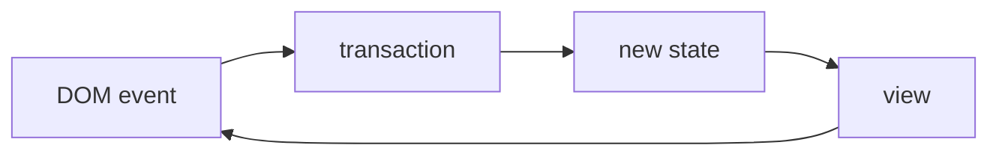

Zennでは、「記事」や「本のチャプター」のMarkdownエディタのベースに[CodeMirror](https://codemirror.net/)というライブラリを使っています。これまではCodeMirrorのv5を使っていた（正確にはv5に依存するラッパーライブラリを使っていた）のですが、古いバージョンを使い続けるリスク解消と更なるエディタの拡張性を得るため、CodeMirrorのv6にアップグレードすることにしました。

本記事では、CodeMirror v6の基本的な知識部分から、ZennのMarkdownエディタを実装するまでのカスタマイズ方法を紹介します。

## CodeMirrorの基礎知識

### はじめに

CodeMirrorはWeb上にコードエディタを実装するためのライブラリです。標準で多くのプログラミング言語に対応したシンタックスハイライトや入力補完、折りたたみ、キーマップ、マルチカーソルなど、モダンなコードエディタに必要な機能を備えています。また、様々な拡張やプラグインを使って、機能を追加・変更することができます。

この拡張性を実現するために、CodeMirrorのライブラリはいくつかのコアモジュールと多くの拡張モジュールに分けられています。自分の好みに合わせたエディタを作るためには、CodeMirrorの基本的なシステム設計を理解しておくと良いです。

そのために、まずはドキュメントの[System Guide](https://codemirror.net/docs/guide/)を読みましょう。これを読んでシステムの全体像を掴んでおくと、[Examples](https://codemirror.net/examples/)や[Reference Manual](https://codemirror.net/docs/ref/)など、その他のドキュメントが理解しやすくなります。

:::message
CodeMirrorはv5とv6で大きく仕様が変わっています。CodeMirrorの情報を調べるときは、バージョンに注意してください。
:::

### CodeMirrorのシステム

この記事を読み進めるために、CodeMirrorのシステムのうち特に重要な部分を、私の理解の範囲でざっくり説明します。

#### コアモジュールと設計思想

CodeMirrorのコアモジュールは、以下の3つに分けられています。

- `@codemirror/state`
- `@codemirror/view`
- `@codemirror/commands`

`state` はエディタの状態や、状態を更新するデータ構造を定義します。`view` はエディタの状態を表示したり、ユーザーの操作を状態を更新するデータ構造に変換するためのコンポーネントです。`command`は多くの編集コマンドとそれらのキー バインディングを定義します。

エディタの状態（`state`）はイミュータブルであり、エディタが新しい状態に移行しても古い状態はそのまま残ります。これにより、エディタの状態の変更を扱いやすくなっています。また、状態に関する操作は純粋な関数として与えられます。

#### 状態管理と更新

こちらは[System Guide](https://codemirror.net/docs/guide/)のState and Updatesで紹介されている、一般的なユーザー操作時のデータフローです。




`view` がブラウザに表示されているエディタだと思ってください。`view` は `state` と呼ばれる状態を持っており、`state` の内容をブラウザにレンダリングしています。`view` はDOMイベント（カーソル移動やキー入力など）を監視し、イベントが発生すると、 `transaction` という状態を更新するためのデータを作成します。 `transaction` から新たな状態（ `new state`） が `view` にディスパッチされると、`view` の `state` が更新されレンダリングされます。

この流れを理解しておくと、「拡張」によりエディタの動きをカスタマイズするときに役に立ちます。

#### 拡張

CodeMirrorのコア機能は必要最小限に抑えられており、多くの機能は拡張として提供されています。拡張は、単なるオプションの設定から、`state` オブジェクトの新しいフィールドの定義、エディタのスタイル設定、`view` へのカスタム命令コンポーネントの注入まで、あらゆることを行うことができますと説明されています。

システム的に見ると、拡張は上記のデータフローの `transaction` や `new state` に介入してユーザー操作をカスタマイズしたり、`view` のレンダリングルールに介入して表示をカスタマイズしたりすることができます。

拡張も `state` として管理され、動的に変更することができます。

## CodeMirrorをReactで扱う準備

### ミニマムなHookの実装

ZennはReactで実装されているため、まずはCodeMirrorをHookにしてReactで扱いやすくします。ここでは `useMarkdownEditor` というHookを実装します。

```typescript:hook側の実装
export const useMarkdownEditor = (props: UseMarkdownEditorProps) => {
  const editor = useRef(null); // EditorViewの親要素のref
  const [container, setContainer] = useState<HTMLDivElement>();
  const [view, setView] = useState<EditorView>();

  // editorのrefをcontainerに設定する
  useEffect(() => {
    if (editor.current) {
      setContainer(editor.current);
    }
  }, [setContainer]);

  // viewを初期化する
  useEffect(() => {
    if (!view && container) {
      const state = EditorState.create();
      const viewCurrent = new EditorView({
        state,
        parent: container,
      });
      setView(viewCurrent);
    }
  }, [view, container]);

  return {
    editor
  };
};
```

```typescript:コンポーネント側の実装
  const { editor } = useMarkdownEditor({});

  return (
    <div ref={editor} />
  );
```

ミニマムな実装例ですが、これでコンポーネントのdiv内にCodeMirrorのエディタが表示されます。この状態では、ぱっとみHTMLのtextareaとあまり変わりありません。


*ミニマムな状態*

### テキストの初期化と保存

Hookに関数を追加することで、エディタにテキストをロードしたり、編集したテキストをコンポーネント側で保存したりする機能を追加していきます。

```typescript:hook側の実装
export const useMarkdownEditor = ({
  doc,
  setDoc,
}: UseMarkdownEditorProps) => {

  // Editorの状態が更新されたときの処理
  const updateListener = useMemo(() => {
    return EditorView.updateListener.of((update: ViewUpdate) => {
      if (update.docChanged) {
        // エディタのテキストが更新されるたびにdocを更新する
        setDoc(update.state.doc.toString());
      }
    });
  }, [setDoc]);

  // viewを初期化する
  useEffect(() => {
    if (!view && container && doc) {
      const state = EditorState.create({
        doc, // エディタの初期値としてdocを設定する
        extensions: [updateListener],
      });
      const viewCurrent = new EditorView({
        state,
        parent: container,
      });
      setView(viewCurrent);
    }
  }, [view, container, doc, updateListener]);

  return {
    editor
  };
};
```

`useState` で定義された `doc` がエディタのテキストと同期されるようになったので、あとはコンポーネント側の任意のタイミングでdocを保存する機能を実装することができます。

```typescript:コンポーネント側の実装
  const [doc, setDoc] = useState<null | string>(null);
  
  const save = useCallback(() => {
    // ここでdocを保存する
  }, [doc]);

  const { editor } = useMarkdownEditor({
    doc,
    setDoc,
  });

  return (
    <div ref={editor} />
  );
```

### （余談）Reactでコードエディタを作りたいならreact-codemirrorを使う手もあり

CodeMirrorをReactで扱うため、当初はCodeMirror v6のラッパーライブラリである[react-codemirror](https://github.com/uiwjs/react-codemirror)を利用しました。react-codemirrorからは `useCodeMirror` というHookが提供されています。

react-codemirrorでは[basicSetup](https://codemirror.net/docs/ref/#codemirror.basicSetup)という「いくつかの拡張を組み合わせて最初からいい感じのコードエディタにしてくれる拡張」がデフォルトで有効になっており、ZennのMarkdownエディタの場合はほとんどの項目を無効化する必要がありました。また、その他の部分でもなるべくライブラリの機能に依存しないように実装したので、最終的にHookを自前で実装することでこちらのライブラリへの依存はなくなりました。

なお、react-codemirrorのソースコードは、CodeMirrorをHookにしたりカスタマイズするのにとても参考になりました。

## ZennのMarkdownエディタの作り方

ここからはZennのMarkdownエディタを作るために、CodeMirrorの拡張による主なカスタマイズを紹介します。

主なカスタマイズは以下のとおりです。

- キーマップ（ショートカットキー）とそれに対応する処理の登録
- ドラッグ＆ドロップやペーストからの画像アップロード機能
- Markdownのシンタックスハイライト
- エディタのスタイル設定
- 標準で提供されている拡張（オプション）の設定

これらの実装方法について、ひとつずつ説明していきます。

### キーマップ（ショートカットキー）の登録

Zennではエディタ操作中にCtrl+s（MacOSならCmd+s）で保存できるようにしています。CodeMirrorでは、キーマップを登録することでショートカットキーを実装できます。

```typescript:コンポーネント側の実装
  const { editor } = useMarkdownEditor({
    doc,
    setDoc,
    save, // docを保存する関数を追加
  });
```

```typescript:hook側の実装
export const useMarkdownEditor = ({
  doc,
  setDoc,
  save,
}: UseMarkdownEditorProps) => {

  // Editor内のキーマップ設定
  const customKeymap = useMemo(() => {
    return keymap.of([
      {
        // 本文の保存
        key: 'Mod-s',
        run() {
          save();
          return true;
        },
      },
    ]);
  }, [save]);

  // Editorのextensionsをまとめる
  const extensions = useMemo(() => {
    return [
      updateListener,
      customKeymap,
    ];
  }, [customKeymap, updateListener]);

  // viewを初期化する
  useEffect(() => {
    if (!view && container && doc) {
      const state = EditorState.create({
        doc,
        extensions,
      });
      const viewCurrent = new EditorView({
        state,
        parent: container,
      });
      setView(viewCurrent);
    }
  }, [view, container, doc, extensions]);

  // extensionsを更新する
  useEffect(() => {
    if (view) {
      view.dispatch({ effects: StateEffect.reconfigure.of(extensions) });
    }
  }, [view, extensions]);

};
```

`keymap.of` でキーマップに関する拡張を作ります。Mod-sはCtrl+s（MacOSならCmd+s）を表しています。`run` にはショートカットキーが押されたときに実行する関数を設定します。ここでは `save` という関数を実行しています。戻り値を `true` にすることで、`preventDefault` と `stopPropagation` が実行されます。

また、extensionsの依存が多くなってきたので、extensionsをuseMemoにまとめました。extensionsの内容が更新されたときは、viewのdispatchでextensionsを更新します。こうすることで動的にエディタの拡張機能を変更できるようになります。

Zennのエディタでは、ショートカットキーとして他にもいくつかの機能を実装しています。さきほどの `keymap.of` に、以下のようなキーマップを追加します。

```typescript:hook側の実装
      {
        // プレビューと編集モードの切替
        key: 'Mod-p',
        run() {
          togglePreview();
          return true;
        },
      },
      {
        // 埋め込みモーダル表示の切替
        key: 'Mod-i',
        run() {
          toggleInsert();
          return true;
        },
      },
      {
        // Boldの設定・解除
        key: 'Mod-b',
        run(view) {
          const range = view.state.selection.main;
          if (
            view.state.sliceDoc(range.from, range.from + 2) == '**' &&
            view.state.sliceDoc(range.to - 2, range.to) == '**'
          ) {
            const transaction = view.state.update({
              changes: {
                from: range.from,
                to: range.to,
                insert: view.state.sliceDoc(range.from + 2, range.to - 2),
              },
            });
            view.dispatch(transaction);
          } else {
            const transaction = view.state.update({
              changes: {
                from: range.from,
                to: range.to,
                insert: `**${view.state.sliceDoc(range.from, range.to)}**`,
              },
            });
            view.dispatch(transaction);
          }
          return true;
        },
      },
```

Mod-p、Mod-i はエディタの外側のコンポーネントの操作です。Mod-bはエディタ内のテキストを更新しています。`run` の引数には `view` が渡されるので、これを使ってエディタの現在の選択範囲を取得し、更新内容を `transaction` にして `view.dispatch` してテキストを更新しています。


*Mod-b, Mod-i, Mod-pの様子（この次に説明する"外部からテキストを挿入する"も適用されています）*

#### 外部からテキストを挿入する

埋め込みモーダルから、カーソル位置にテキストを挿入するために、Hookから以下の関数を提供します。

```typescript:hook側の実装
  // Editorのカーソル位置にテキストを挿入する
  const insertTextToEditor = useCallback(
    (text: string) => {
      if (!view) return;

      const transaction = view.state.update({
        changes: {
          from: view.state.selection.main.head,
          insert: text,
        },
      });
      view.dispatch(transaction);
    },
    [view]
  );

  return {
    editor,
    focusToEditor,
    insertTextToEditor,
  };
```

`view.state.selection` が、現在のカーソル位置を示します。CodeMirrorはマルチカーソル・複数選択範囲に対応していますが、Zennではマルチカーソルは使わないので `main` でカーソル位置を取得しています。

#### 発生した問題

エディタからキーマップで埋め込みモーダルを開き、モーダルを閉じるとスクロール位置がTOPに戻るという事象が発生しました。ワークアラウンドとして、モーダルを閉じたときにエディタをフォーカスすることで解決しました。

```typescript:hook側の実装
  // Editorをフォーカスする
  const focusToEditor = useCallback(() => {
    if (!view) return;
    view.focus();
  }, [view]);

  return {
    editor,
    focusToEditor,
  };
```

原因は不明ですが、キーマップでモーダルを開くときにエディタに何らかのイベント（状態の更新）が発生しており、モーダルを閉じたタイミングでエディタがフォーカスを失っているため、正しいスクロール位置を計算できずTOPに戻ってしまったのではないかと推測しています。

このように原因不明の問題が発生したときは、エディタに発生したイベントをトレースしてみると手がかりが得られるかもしれません。

```typescript:hook側の実装
  // これをextensionsに追加する
  const updateListener = EditorView.updateListener.of((update) => {
    console.log('update', update);
  });
```

### 画像アップロード

Zennのエディタでは、画像アップロードボタンからの他に、「エディタに画像をドロップする方法」と「画像を貼り付ける方法」で画像をアップロードできるようにしています。これらはエディタのDOM Eventをハンドリングすることで実現できます。

```typescript:hook側の実装
  // Editor内で発生するイベントのハンドラー（extensionsに追加する）
  const eventHandlers = useMemo(
    () =>
      EditorView.domEventHandlers({
        // 画像ファイルがドラッグ＆ドロップされたときの処理
        // ref: https://developer.mozilla.org/ja/docs/Web/API/HTML_Drag_and_Drop_API/File_drag_and_drop#%E3%83%89%E3%83%AD%E3%83%83%E3%83%97%E3%81%AE%E5%87%A6%E7%90%86
        drop(event, view) {
          if (!event.dataTransfer) return;

          const insertText = (url: string) => {
            // eventが発生したカーソルの位置を取得する
            const cursorPos = view.posAtCoords({
              x: event.pageX,
              y: event.pageY,
            });
            const insertText = ``;
            const transaction = view.state.update({
              changes: {
                from: cursorPos || 0,
                insert: insertText,
              },
            });
            view.dispatch(transaction);
          };

          // DataTransferItemList インターフェイスを使用して、ファイルにアクセスする
          if (event.dataTransfer.items) {
            for (let i = 0; i < event.dataTransfer.items.length; i++) {
              const item = event.dataTransfer.items[i];
              // ドロップしたものがファイルでない場合は拒否する
              if (item.kind === 'file') {
                const file = item.getAsFile();
                if (!file) return;

                imageUpload(file, (url) => {
                  insertText(url);
                });
              }
            }
          } else {
            // DataTransfer インターフェイスを使用してファイルにアクセスする
            for (let i = 0; i < event.dataTransfer.files.length; i++) {
              const file = event.dataTransfer.files[i];

              imageUpload(file, (url) => {
                insertText(url);
              });
            }
          }
        },

        // 画像ファイルがペーストされたときの処理
        paste(event, view) {
          if (!event.clipboardData?.files?.length) return;

          for (let i = 0; i < event.clipboardData.files.length; i++) {
            const file = event.clipboardData.files[i];

            imageUpload(file, (url) => {
              const insertText = ``;
              const transaction = view.state.update({
                changes: {
                  from: view.state.selection.main.head,
                  insert: insertText,
                },
              });
              view.dispatch(transaction);
            });
          }
        },
      }),
    [imageUpload]
  );
```

`drop` と `paste` のイベントハンドラを書きました。`imageUpload` という関数は、画像ファイルをアップロードして、コールバック関数でファイルのURLを引数に渡して呼び出す関数です。`drop` イベントでは、DOM Eventからブラウザ上のカーソルの位置を取得し、`view.posAtCoords` によってそれがエディタのどの位置かを割り出して、そこに画像のURLを挿入する処理をしています。


*1回目はドラッグ＆ドロップ、2回目はファイルをコピー＆ペーストしている様子*

### Markdown記法の装飾

エディタ内のテキストのMarkdown記法を装飾（シンタックスハイライト）するためには、「markdownパーサーにより構文を解析する」「構文にスタイルを適用する」の2つの処理が必要です。

#### markdown拡張により構文を解析する

CodeMirrorは、様々なプログラミング言語の拡張を提供しており、これによりエディタ内のテキストを解析して、構文を解析することができます。ZennのエディタはMarkdownエディタなので、[lang-markdown](https://github.com/codemirror/lang-markdown)を追加します。

```typescript:hook側の実装
  // Editorのextensions
  const extensions = useMemo(() => {
    return [
      markdown({
        // markdownパーサーをGFM(https://github.github.com/gfm/)にする。
        // CommonMarkにない記法の装飾ができるようになる。
        base: markdownLanguage,
        completeHTMLTags: false, // HTMLタグのオートコンプリートを無効化
      }),
    ];
  }, []);
```

#### 構文にスタイルを適用する

構文にスタイルを適用するには、`syntaxHighlighting` 拡張機能を使います。Zennのエディタでは、Markdown記法のスタイルを以下のように設定しています。

```typescript:hook側の実装
  // Markdown記法のハイライト設定
  const highlightStyle = HighlightStyle.define([
    { tag: tags.heading1, color: 'black', fontSize: '1.4em', fontWeight: '700' },
    { tag: tags.heading2, color: 'black', fontSize: '1.3em', fontWeight: '700' },
    { tag: tags.heading3, color: 'black', fontSize: '1.2em', fontWeight: '700' },
    { tag: tags.heading4, color: 'black', fontSize: '1.1em', fontWeight: '700' },
    { tag: tags.strong, color: 'black', fontWeight: '700' }, // 太字
    { tag: tags.quote, color: '#6a737d' }, // 引用
    { tag: tags.emphasis, fontStyle: 'italic' }, // 斜体
    { tag: tags.url, textDecoration: 'underline' }, // URLに下線をつける
    { tag: tags.strikethrough, textDecoration: 'line-through' }, // 打ち消し線（GFM拡張）
  ]);

  // Editorのextensions
  const extensions = useMemo(() => {
    return [
      syntaxHighlighting(highlightStyle),
      markdown({
        // markdownパーサーをGFM(https://github.github.com/gfm/)にする。
        // CommonMarkにない記法の装飾ができるようになる。
        base: markdownLanguage,
        completeHTMLTags: false, // HTMLタグのオートコンプリートを無効化
      }),
    ];
  }, []);
```


*リアルタイムにシンタックスハイライトが適用される*

### エディタのCSSの設定

エディタのスタイルはthemeという拡張機能で設定します。themeではCSS-in-JSでスタイルを設定します。もちろん動的に変更することもできます。

```typescript:hook側の実装
  const editorStyle = useMemo(() => {
    return EditorView.theme({
      '&': {
        minHeight: '500px',
      },
      // editorの外枠
      '&.cm-editor': {
        outline: 'none', // エディターの枠線を非表示
      },
      // editorの内部
      '&.cm-editor .cm-scroller': {
        fontFamily: `'SFMono-Regular', Consolas, 'Liberation Mono', Menlo, monospace, 'Segoe UI Emoji'`,
        '-webkit-font-smoothing': 'antialiased',
        letterSpacing: '0.02em',
        fontSize: '15px',
        lineHeight: '1.8',
        color: '#000000',
      },
      // 選択範囲の背景色
      '.cm-selectionBackground': {
        backgroundColor: '#036dd626 !important',
      },
    });
  }, []);

  // Editorのextensions
  const extensions = useMemo(() => {
    return [
      editorStyle,
    ];
  }, [editorStyle]);
```

### その他の拡張

その他、CodeMirrorに標準搭載されている拡張機能を使って、エディタの機能を調整しています。

```typescript:hook側の実装
  // Editorのextensions
  const extensions = useMemo(() => {
    return [
      placeholder('Write in markdown'),
      history(), // undo/redoを有効化
      keymap.of(defaultKeymap), // defaultKeymapを有効化
      keymap.of(historyKeymap), // historyKeymapを有効化
      keymap.of([indentWithTab]), // タブキーをbindしてインデントの上げ下げに使用する。入力される文字列はindentUnitで設定する
      indentUnit.of('    '), // インデントの単位をスペース4個にする。@codemirror/lang-markdownでネストしたリストに正しい挙動をさせるには2-5の範囲にする必要がある
      EditorView.lineWrapping, // テキストの折返しを有効化
      EditorState.tabSize.of(4), // Tab（\t）をスペース4個分の大きさにする
    ];
  }, []);
```

## おわりに

CodeMirror v6について調べ始めた頃、具体的な情報が少なくライブラリの使い方が分からずに苦労したので本記事を書きました。本記事の内容は、CodeMirrorの全体から見るとほんのさわりでしかありませんが、これからCodeMirror v6を使ってエディタを作る人の参考になれば幸いです。

ZennのMarkdownエディタはさらなる執筆体験の向上を目指し、引き続き開発を進めていきます。お楽しみに！
