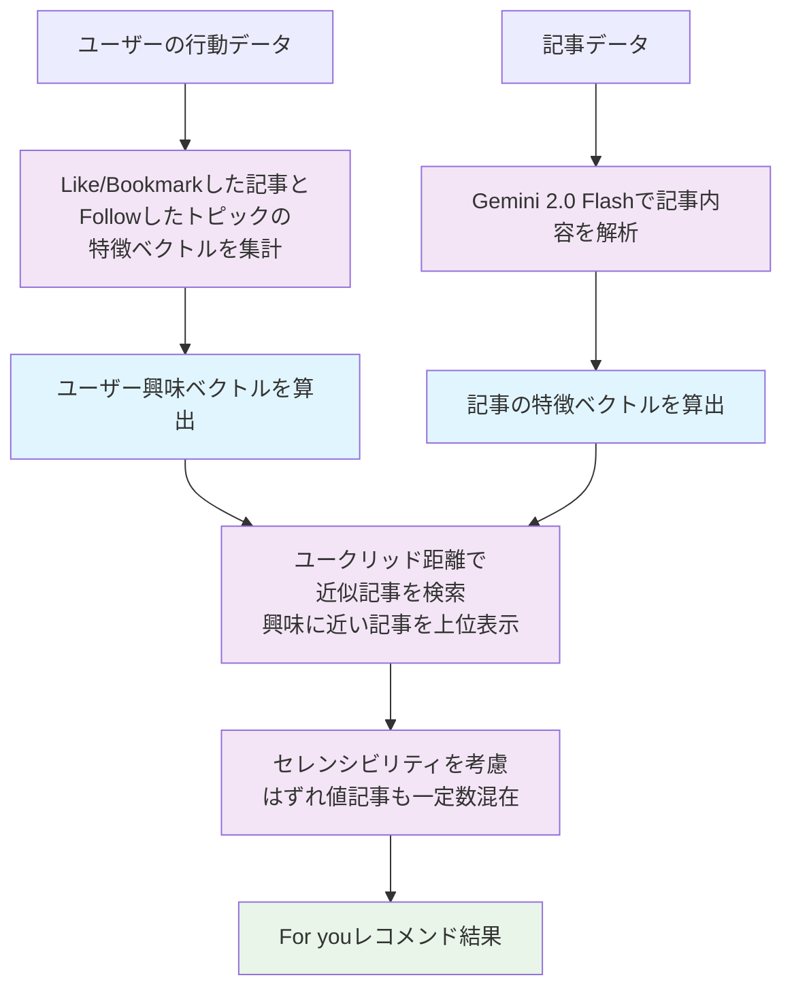

## はじめに

Zennではこれまで、独自の集計方法により新着記事のランキング（Trending）を提供してきました。Zennの読者にはWeb開発系のユーザーが多く、TrendingにはWeb開発系の記事が上位になりやすい傾向がありました。

昨年実施した[ユーザーアンケート](https://info.zenn.dev/2025-02-25-questionnaire-summary)では、「Trendingが自分にマッチしていない」という意見が一定数寄せられ、レコメンド機能を求めるユーザーが75%に上ることが判明しました。

読者層の多様化に伴う新たなニーズに応えるため、記事のレコメンド機能（For you）を開発することにしました。


*左が Trending、右が For you*

本記事では、Zennのレコメンドシステムで活用している、AIとベクトル近傍検索を使った記事のレコメンドシステムの仕組みについて説明します。

## 方針の検討

一口にレコメンドと言っても、目的や適応箇所によって、その手法はさまざまです。大分類として「内容ベースフィルタリング」か「協調フィルタリング」のいずれを採用するかがあります。またそのアルゴリズムとして、単純なルールベースのものから機械学習モデルを使う高度なものまで多岐にわたります。

Zennチームの現状としては、レコメンドシステムに関する知見がなく、機械学習モデルを開発・維持するには多くのリソースが必要となるため、初手としては **なるべくシンプルな（失敗しても傷が浅い）方法で実現したい** と考えました。

余談ですが、私はレコメンドシステムについての知見がなかったので、初めに「[推薦システム実践入門](https://www.oreilly.co.jp//books/9784873119663/)」を読みました。レコメンドシステムの全体像や主要なアルゴリズムを知ることができ、最初のインプットとしてとても有益でした。

次にデータ量について考えます。現在、Zennでは1日に約200件の記事が新規投稿されます。Trendingに表示される記事は投稿から最大でも7日程度のものとなるため、レコメンドの候補となる記事は約1400件という限られた数になります。

この数では、すべてのユーザーの興味関心にピンポイントな記事をレコメンドすることは困難と考えました。ニッチな記事は数が少ないので期間を広げて候補を増やす必要がありますが、そうすると今度はレコメンドする記事の流動性が損なわれます。そこで、ユーザーの興味にピンポイントな記事を提示することはあえて狙わず、 **ユーザーの興味にある程度近い記事が表示される** ことを目標として設定しました。AWSに関心があるユーザーは他のクラウドサービスにも多少の関心があるはず、というような考え方です。

## レコメンドシステムの検討

レコメンドシステムの具体的な仕組みを検討しました。

まず、「内容ベースフィルタリング」と「協調フィルタリング」のどちらを使うかを検討します。

「内容ベースフィルタリング」とは、文字通りコンテンツの「内容の近さ」によりレコメンドする手法です。一方の「協調フィルタリング」は、コンテンツの内容そのものではなく、興味が近いユーザーが好むコンテンツをレコメンドする手法です。一般的にレコメンドの精度としては「協調フィルタリング」の方が良いとされています（使用用途にもよります）が、より複雑な計算が必要になることや、コールドスタートの問題（新規コンテンツや新規ユーザーに対しては協調フィルタリングが機能しない）などもあるため、初手としては「内容ベースフィルタリング」を選択しました。

次にユーザーの興味と記事の「近さ」を決める方法を検討します。既存のデータとしては、記事に設定された「トピック」や「Like」「Bookmark」「Follow」などが使えそうですが、どれも機械的なフィルターになりがちです。「トピック」に関しては、記事の著者がどのトピックを付けるかに依存するので、取りこぼしが多くなります。そこで、記事の内容をAIで解析して「特徴ベクトル」を算出し、ベクトル近傍検索を使ってユーザーの興味に近い記事をレコメンドすることを考えました。

通常、LLMによるベクトル化（embeddings）では、数百〜1000次元以上の高次元ベクトルが生成されますが、Zennではデータ量が少ないことと、人間が把握しやすいように、記事の特徴を6次元のベクトルで表現することにしました。これにより、計算コストを抑えつつ、記事の特徴をある程度表現できると考えました。

記事の特徴は以下の6つのカテゴリーに分類しました。

- システム開発・プログラミング全般: 一般的なプログラミング言語や設計手法、データベースも含むソフトウェア全般を扱います。
- Web開発: HTML/CSS/JSやサーバーサイド技術、Webアプリ開発や関連セキュリティなどを扱います。
- インフラ: クラウドサービスやネットワーク、コンテナ・仮想化などインフラ運用全般を扱います。
- アプリ開発: iOS/Androidやクロスプラットフォームなど、モバイルアプリ開発全般を扱います。
- AI: 深層学習やLLM、機械学習フレームワークなどAI関連全般を扱います。
- データ分析: データ分析や統計、ETL、BIなどデータエンジニアリング全般を扱います。

それぞれのカテゴリーについて値は0.01~1.00の範囲で持ちます。全て当てはまらない記事や、多くのカテゴリーに当てはまる記事があるため、ベクトルの正規化は行いませんでした。

### 記事の特徴ベクトルの算出

検証当初は、Gemini 1.5 Flash と Gemini 1.5 Pro を検証しました。Flashでは実用的な精度が得られませんでしたが、Proはかなり良い精度が得られました。しかし、コストが課題になりました。新着記事だけなら数は少ないのですが、ユーザーの興味ベクトルを算出をするには、これまでユーザーが「Like」「Bookmark」したすべての記事の特徴ベクトルを算出しておく必要があり、Zennには公開されているだけで15万件以上の記事がありましたので、これをすべて算出すると$300以上のコストがかかる見込みでした。

腹を括ろうとしたところ、Gemini 2.0がリリースされ、Gemini 1.5 ProとGemini 2.0 Flashで同程度の精度が得られることが分かりましたので、Gemini 2.0 Flashを使うことにしました。これにより、LLMのコストは約1/5に削減されました。

例えば私の記事ですと、以下の結果が得られます。

https://zenn.dev/team_zenn/articles/optimize-frontend-build-in-cloud-build

```
{
  "system_development": 0.2,
  "web_development": 0.95,
  "infrastructure": 0.8,
  "app_development": 0.05,
  "ai": 0.05,
  "data_analysis": 0.05
}
```

https://zenn.dev/team_zenn/articles/cm6-simple-search-extension

```
{
  "system_development": 0.85,
  "web_development": 0.95,
  "infrastructure": 0.05,
  "app_development": 0.05,
  "ai": 0.05,
  "data_analysis": 0.05
}
```

1つ目の記事ではWeb開発とインフラに強く関連していることが分かります。2つ目の記事では、システム開発とWeb開発に強く関連していることが分かります。

### ユーザーの興味ベクトルの算出

ユーザーの興味ベクトルは、ユーザーの直近の行動データ（LikeやBookmark、フォロートピック）から算出します。行動対象の記事の「特徴ベクトル」を集計し、ユーザーの興味を表現するベクトルを算出します。単純に平均を取ると、特徴が薄まってしまうため、数値に補正をかけて特徴が際立つようにしています。

新規ユーザーなど行動データ（LikeやBookmark）が少ないユーザーに対しては、興味があるトピックを選択してもらう仕組みを用意しました。各トピックも、そのトピックに付けられた記事の「特徴ベクトル」を元に、トピック自体の「特徴ベクトル」を集計しています。


*十分な行動データがない場合*

### ベクトル近傍検索とマッチングアルゴリズム

ベクトル近傍検索を用いて、ユーザーの興味ベクトルに近い特徴ベクトルを持つ記事を検索します。

ベクトル近傍検索については、Zennのデータベースとして利用しているCloud SQLに[pgvector拡張](https://github.com/pgvector/pgvector)（PostgreSQLの拡張。ベクトル型とベクトル演算をサポートする）を導入することで実現できました。

ベクトル近傍検索の方式としては、主に「ユークリッド距離」「コサイン類似度」「内積」があります。これらの方式は、ベクトルの距離や角度を計算することで、どれだけ近いかを評価します。

Zennでは **ユークリッド距離** を採用しました。レコメンドシステムではあまり使われない選択ですが、正規化されていない・次元数が小さいベクトルにおいては、ユークリッド距離が一番素直な結果が得られました。

コサイン類似度については、カテゴリーの関連度の大きさが反映されないため、関連度が低くても類似度が高くなるケースがありました。

内積については、複数のカテゴリーに関連する記事ほど値が大きくなるため、複数のカテゴリーに属する記事が過度に優位に働く問題がありました。

:::message
これは初回の実装であり、今後変更する可能性が大いにあります。
:::

### セレンシビリティ

セレンシビリティは「予想外の発見」などを意味する言葉で、レコメンドシステムにおいては、ユーザーの興味とは異なる結果を意図的に含めることで、ユーザーに新たな発見を提供する手法です。

Zennでは、セレンシビリティを意識して、ユーザーの興味ベクトルに近い記事を上位に表示しつつ、はずれ値の記事も一定数表示するようにしています。これにより、ユーザーが普段は見ないような記事にも触れる機会を提供します。

### 処理の流れ

ここまでの処理の流れをまとめると、以下のようになります。



## 結果と課題

レコメンド機能（For you）をβリリースして2ヶ月半ほど経過しました。現時点で見えてきた結果と課題についてまとめます。

まず、日々のアクセス数から見るに、For youページが習慣的に閲覧される（=また見たいと思える精度）までに至っていないことは明らかです。

フィードバックに寄せられる主なネガティブ意見としては、「興味がない記事が多く表示される」というものでした。これは方針の段階で想定されていた結果ですが、普段からSNSやYouTubeなどのレコメンド機能に慣れている我々にとって、レコメンド機能に対する期待値は相当高いものであるということが分かりました。

また、結果の透明性や調整に関するフィードバックも多数ありました。「なぜこの記事が表示されているかわからない」「このトピック・記事には興味がないことを示したい」など。レコメンドの結果をユーザーがコントロールできることが、ユーザーにとって重要な要素であると感じました。

フィードバックをお寄せいただいた皆さま、ありがとうございます。

## 今後の展望

βリリースで得られたフィードバックから、「レコメンドの精度」と「結果のコントロール」に課題 = 改善の余地があることが分かりました。引き続き、興味関心の高い情報をお届けできるよう改善を進めていきますので、みなさまぜひフィードバックをお寄せください。
